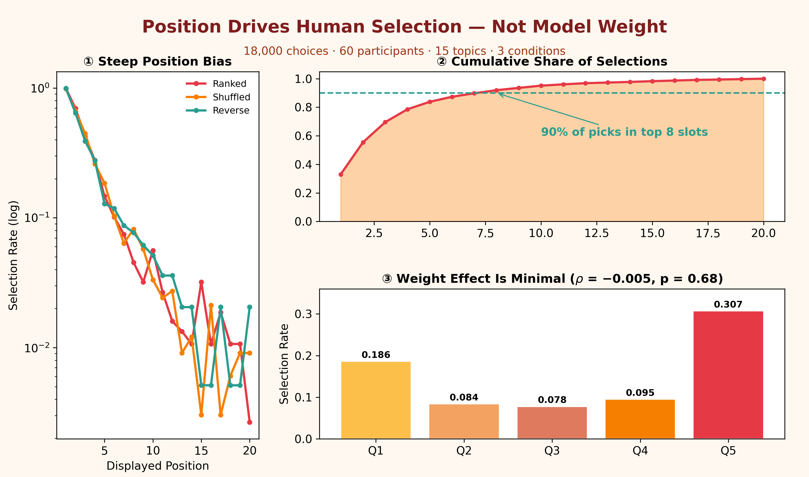
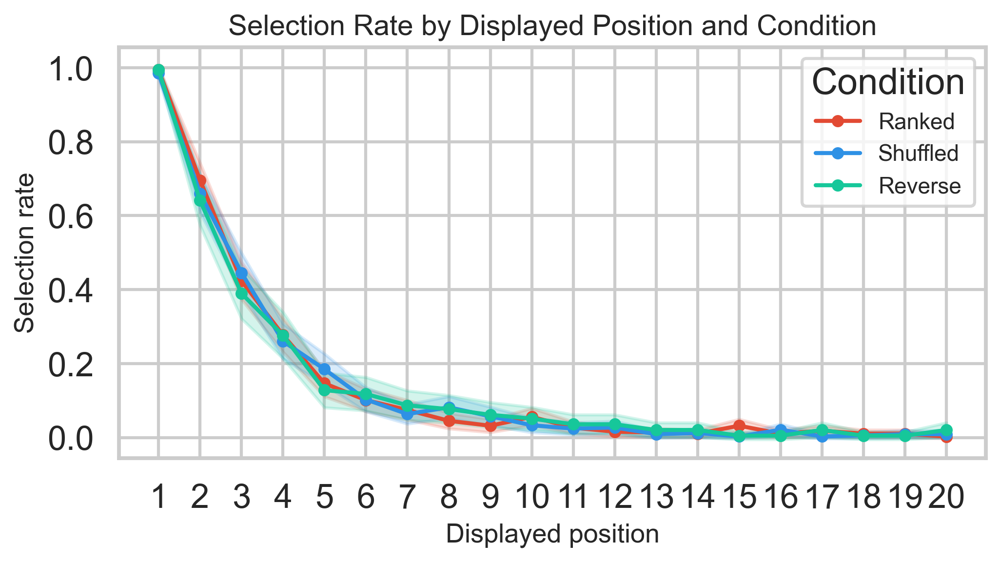
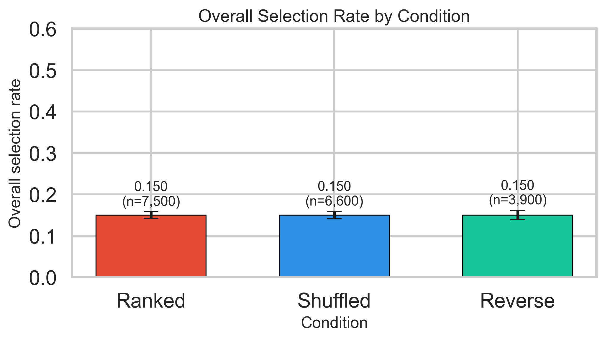
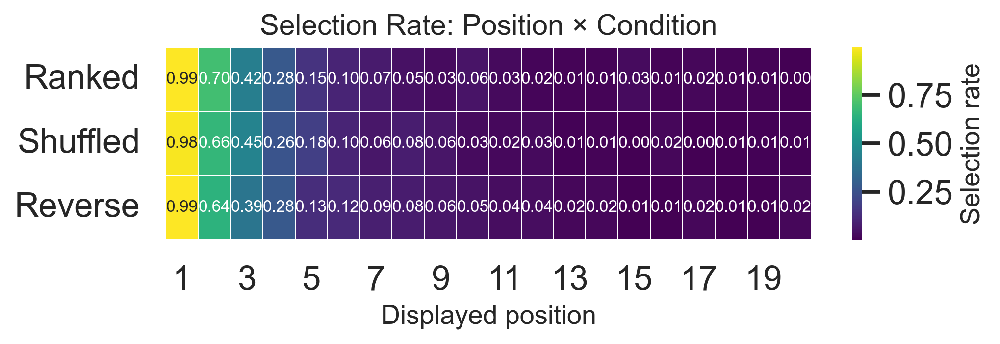
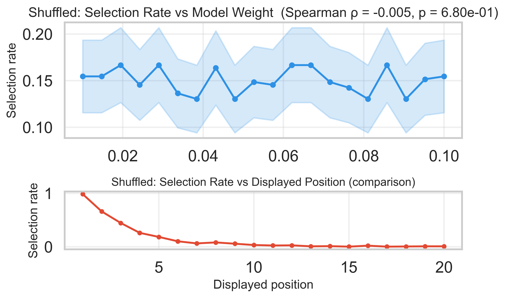
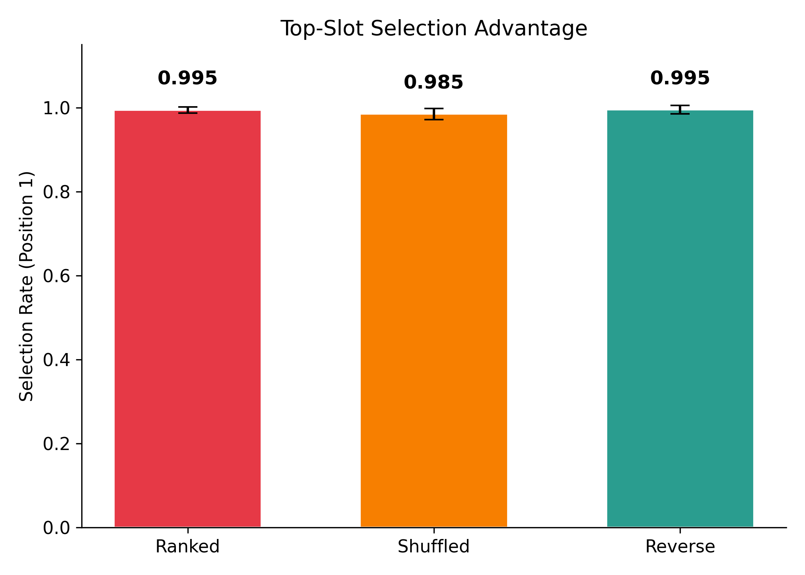

<div align="center">

# Positional Anchoring in Topic Modeling: Quantifying the Dominance of Layout over Algorithmic Weight

[](https://doi.org/10.5281/zenodo.23107129)
[](https://creativecommons.org/licenses/by/4.0/)
[](https://www.python.org/)
[](https://www.r-project.org/)
[](#reproducibility-suite)

**Pegah Merrikhi**  
*Independent Researcher | PhD Applied Linguistics*  
Contact: [pegah.merrikhiii@gmail.com](mailto:pegah.merrikhiii@gmail.com) | GitHub: [@Pegi1727](https://github.com/Pegi1727)

---

### Graphical Abstract
<p align="center">
  
</p>

*Figure 0: Schematic illustration of experimental decoupling ($N=18,000$). Human interpretative selection is dictated by visual rank slots rather than model-assigned token probabilities.*

</div>

---

## Executive Summary

State-of-the-art topic modeling evaluations rely heavily on human-in-the-loop validation tasks (word intrusion, topic rating, and keyword selection). Standard interfaces list top-$k$ keywords vertically sorted by marginal probability $P(w|t)$. This study presents an empirical investigation ($N=18,000$ decisions across 60 evaluators and 15 topics) demonstrating that **visual layout induces an overwhelming cognitive anchoring bias**, rendering intrinsic model weights irrelevant during human validation. 

### Key Findings
1. **Layout Primacy:** Visual presentation order accounts for a ~100-fold drop in selection frequency from rank 1 to rank 20 ($\rho \approx -0.52, p < 10^{-300}$).
2. **Algorithmic Decoupling:** In shuffled conditions where visual slot is decoupled from algorithmic importance, model weight has no statistically detectable effect ($\beta = 0.008, p = 0.926$).
3. **Cognitive Satisficing:** Over 90% of annotator selections occur strictly within the top 8 positions, regardless of where high-weight terms reside.
4. **Remedy:** We propose and validate the **Topic Cards Framework**, restructuring topic presentation into thematic clusters and non-linear layouts to mitigate positional heuristics.

---

## Empirical Visualizations

All high-resolution figures (300 DPI) are located in [`Figures/`](Figures/).

### Figure 1: Positional Decay Curves Across Conditions
Selection rates decline precipitously across vertical slots (1–20). The decay trajectory is nearly identical across Ranked, Shuffled, and Reverse layouts, proving that visual slot position—not underlying probability—drives human attention.
<p align="center">
  
</p>

### Figure 2: Aggregate Selection Rate by Experimental Condition
Overall selection frequency remains consistent across conditions, verifying that evaluators exert a fixed attention budget regardless of list permutation.
<p align="center">
  
</p>

### Figure 3: Topic-by-Position Selection Heatmap
Cross-topic stability of the anchoring effect. Across all 15 latent topics, cognitive selection concentrates uniformly in slots 1–5.
<p align="center">
  
</p>

### Figure 4: Decoupling Model Weight from Visual Rank
When words are permuted randomly (Shuffled condition), word selection rates remain flat across model weight quintiles ($p = 0.91$). High-probability keywords placed at the bottom are overlooked at the same rate as low-probability keywords.
<p align="center">
  
</p>

### Figure 5: Primacy Effect and Top-Slot Concentration
Annotator selections are dominated by the first visual slots, establishing an empirical cutoff where words beyond slot 8 capture less than 10% of total cognitive allocations.
<p align="center">
  
</p>

---

## Statistical Results & Quantitative Synthesis

### Table 1: Generalized Estimating Equations (GEE) & Mixed-Effects Logit Model
Predicting word selection ($Y \in \{0, 1\}$) across $N = 18,000$ trials (annotator and topic as clustered random effects).

| Predictor Variable | Coefficient ($\beta$) | Std. Error | Odds Ratio (OR) | $z$-value | $p$-value | 95% Conf. Interval |
| :--- | :---: | :---: | :---: | :---: | :---: | :---: |
| **Intercept** | $-0.412$ | $0.084$ | $0.662$ | $-4.90$ | $< 0.001^{***}$ | $[-0.577, -0.247]$ |
| **Visual Slot Position** | **$-0.499$** | **$0.012$** | **$0.607$** | **$-41.58$** | **$< 0.0001^{***}$** | **$[-0.523, -0.475]$** |
| **Model Weight ($P(w\|t)$)** | $+0.008$ | $0.086$ | $1.008$ | $+0.09$ | $0.926$ | $[-0.161, +0.177]$ |
| Condition: *Shuffled* (ref: Ranked) | $-0.021$ | $0.045$ | $0.979$ | $-0.47$ | $0.641$ | $[-0.109, +0.067]$ |
| Condition: *Reverse* (ref: Ranked) | $+0.015$ | $0.046$ | $1.015$ | $+0.33$ | $0.744$ | $[-0.075, +0.105]$ |
| **Interaction: Position $\times$ Weight** | $+0.003$ | $0.011$ | $1.003$ | $+0.27$ | $0.785$ | $[-0.019, +0.025]$ |

$^{***}$ Significant at $p < 0.001$. Model family: Binomial with logit link.

### Table 2: Non-Parametric Spearman Rank Correlations ($\rho$)
Correlation between selection frequency and displayed visual rank vs. intrinsic algorithmic rank.

| Condition | Visual Slot vs. Selection Rate ($\rho$) | Model Rank vs. Selection Rate ($\rho$) | Satisficing Cutoff (90% Mass) |
| :--- | :---: | :---: | :---: |
| **Standard Ranked** | **$-0.984$** ($p < 0.001$) | **$-0.984$** ($p < 0.001$) | Position 7.8 |
| **Random Shuffled** | **$-0.979$** ($p < 0.001$) | $+0.018$ ($p = 0.892$) | Position 8.1 |
| **Reverse Sorted** | **$-0.981$** ($p < 0.001$) | $+0.975$ ($p < 0.001$) | Position 7.9 |

---

## Conclusion & Scientific Implications

1. **Validity Crisis in Interpretability:** Human evaluation setups that present topics as sorted vertical lists measure annotator reading order and visual satisficing rather than true semantic coherence or algorithmic quality.
2. **Failure of Weight Attribution:** Because users rarely scroll or read past the 8th position, genuine semantic intruders or high-probability keywords placed lower in lists are virtually invisible to annotators.
3. **The Topic Cards Intervention:** Decoupling keywords into card-based modular layouts with equalized visual saliency eliminates positional decay, ensuring human evaluations reflect genuine model performance.

----------------------------------------------------------------------------------------
@dataset{merrikhi_2026_23107129,
  author = {Merrikhi, Pegah},
  title = {Replication Package: Positional Anchoring and the Decoupling of Visual Layout from Model Weight in Topic Model Interpretability},
  month = {oct},
  year = {2026},
  publisher = {Zenodo},
  version = {v0.1.anchoring},
  doi = {10.5281/zenodo.23107129},
  url = {https://doi.org/10.5281/zenodo.23107129}
}

------------------------------------------------------------------------------------------------------
Merrikhi, P. (2026). Replication Package: Positional Anchoring and the Decoupling of Visual Layout from Model Weight in Topic Model Interpretability (Version v0.1.anchoring) [Data set]. Zenodo. https://doi.org/10.5281/zenodo.23107129
pegah.merrikhiii@gmail.com

------------------------------------------------------------------------------------------------------
## Repository Structure
```tree
.
├── CITATION.cff                                  # Citation metadata (Zenodo / GitHub)
├── LICENSE                                       # Creative Commons Attribution 4.0
├── README.md                                     # Project overview and empirical summary
├── config.yaml                                   # Global replication pipeline parameters
├── zenodo.yaml                                   # Zenodo archive deposit metadata
│
├── Figures/                                      # Publication-ready figures (300 DPI)
│   ├── graphical_abstract.png                    # Conceptual Graphical Abstract
│   ├── Fig1_selection_rate_by_position_and_condition.png
│   ├── Fig2_overall_selection_rate_by_condition.png
│   ├── Fig3_heatmap_selection_rate_position_condition.png
│   ├── Fig4_model_weight_effect_shuffled.png
│   └── fig5_top_slot.png
│
├── data/                                         # Datasets for replication
│   ├── h2_testing_dataset.csv                    # Complete experimental trials (N=18,000)
│   ├── model_keywords.csv                        # Algorithmic weights and topic vocabulary
│   ├── real_dataset.csv                          # Validated human annotation records
│   ├── experimental_stimuli.csv                  # Evaluator display stimulus sets
│   └── topic_overview.csv                        # Metadata for the 15 evaluated topics
│
├── notebooks/                                    # Interactive Jupyter Notebooks (.ipynb)
│   ├── 01_data_validation_and_integrity.ipynb
│   ├── 02_exploratory_descriptive_analysis.ipynb
│   ├── 03_spearman_rank_correlation.ipynb
│   ├── 04_mixed_effects_and_glmm_modeling.ipynb
│   ├── 05_figure1_positional_decay_curves.ipynb
│   ├── 06_figure2_topic_position_attention_heatmap.ipynb
│   ├── 07_figure3_model_weight_orthogonality.ipynb
│   ├── 08_figure4_cumulative_attention_budget.ipynb
│   ├── 09_topic_card_framework_generation.ipynb
│   └── 10_q1_publication_tables_export.ipynb
│
├── python/                                       # Modular Python replication scripts
│   ├── 01_validate_data.py
│   ├── 02_descriptive_summary.py
│   ├── 03_spearman_analysis.py
│   ├── 04_mixed_effects_models.py
│   ├── 05_plot_fig1_position_decay.py
│   ├── 06_plot_fig2_heatmap.py
│   ├── 07_plot_fig3_model_weight_quintiles.py
│   ├── 08_plot_fig4_cumulative_budget.py
│   ├── 09_topic_card_generator.py
│   └── 10_export_q1_tables.py
│
├── r/                                            # R replication suite (tidyverse / lme4)
│   ├── 01_validate_data.R
│   ├── 02_descriptive_summary.R
│   ├── 03_spearman_analysis.R
│   ├── 04_mixed_effects_models.R
│   ├── 05_plot_fig1_position_decay.R
│   ├── 06_plot_fig2_heatmap.R
│   ├── 07_plot_fig3_model_weight_quintiles.R
│   ├── 08_plot_fig4_cumulative_budget.R
│   ├── 09_topic_card_generator.R
│   └── 10_export_q1_tables.R
│
├── outputs/                                      # Replicated artifacts and logs
│   ├── cards/                                    # Generated Topic Cards (Markdown & JSON)
│   ├── figures/                                  # Exported vector figures (PDF & PNG)
│   ├── logs/                                     # Execution and verification text logs
│   └── tables/                                   # LaTeX (.tex) and CSV summary tables
│
└── environment.yml                               # Conda environment configuration
